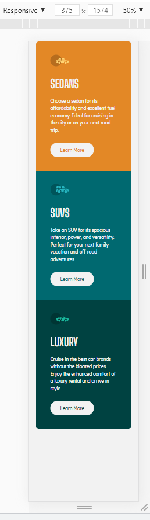

# Frontend Mentor - 3-column preview card component solution

This is a solution to the [3-column preview card component challenge on Frontend Mentor](https://www.frontendmentor.io/challenges/3column-preview-card-component-pH92eAR2-). Frontend Mentor challenges help you improve your coding skills by building realistic projects. 

## Table of contents

- [Overview](#overview)
  - [The challenge](#the-challenge)
  - [Screenshot](#screenshot)
  - [Links](#links)
- [My process](#my-process)
  - [Built with](#built-with)
  - [What I learned](#what-i-learned)
  - [Continued development](#continued-development)
  - [Useful resources](#useful-resources)
- [Author](#author)
- [Acknowledgments](#acknowledgments)

## Overview

### The challenge

Users should be able to:

- View the optimal layout depending on their device's screen size
- See hover states for interactive elements

### Screenshot

 

### Links

- Solution URL: (https://sbapollocoder.github.io/threecolumnpreviewcardcomponent/index.html)

## My process

### Built with

- Semantic HTML5 markup
- CSS custom properties
- Flexbox

### What I learned

- Continued use of flexbox
- Used box-sizing: border-box; to help keep to precise sizes
- Used a media query

### Continued development

- Clean up the CSS with Sass, specifically the colours, better hierarchy and possibly splitting out sections, and find out how to automate the Sass process when deploying
- Possibly find better ways to target the CSS elements
- The challenge only specified certain screen sizes which has been kept to but it could be extended to be responsive at more sizes

### Useful resources

- (https://css-tricks.com/snippets/css/a-guide-to-flexbox/) - Explains flexbox with some great examples that are laid out well and understandable.

## Author

- Frontend Mentor - [@sbapollocoder](https://www.frontendmentor.io/profile/sbapollocoder)

## Acknowledgments

Coder Coder's video (https://www.youtube.com/watch?v=8w_kHIAkucA)